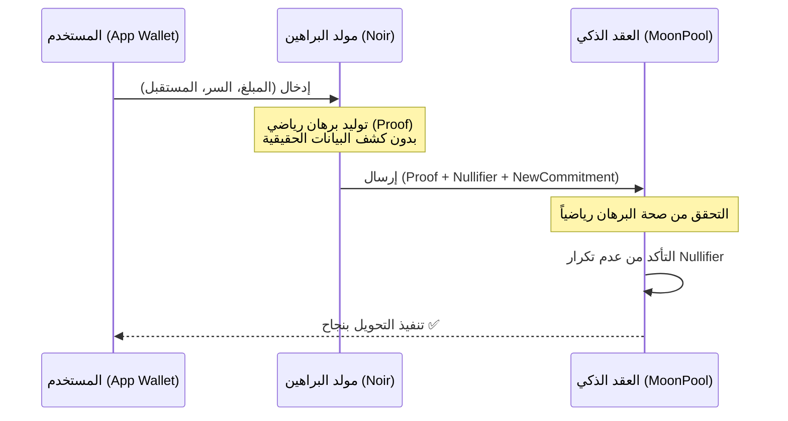

# 🏗️ بنية Moonify: أمن الخصوصية والهوية الرقمية (ZK-ID)

يركز نظام **Moonify** بشكل أساسي على حل مشكلة "الشفافية المطلقة" في البلوكتشين، حيث يتم كشف جميع الأرصدة والمعاملات. Moonify يوفر طبقة حماية تجعل بياناتك وهويتك المالية مخفية وآمنة تماماً.

---

## 🎯 الهدف الجوهري: الخصوصية كحق أساسي

في Moonify، الخصوصية ليست مجرد ميزة، بل هي **الهيكل الأساسي**:
1. **إخفاء الهوية (Identity Security)**: لا ترتبط معاملاتك بعنوان محفظتك العام (0x...).
2. **إخفاء المبالغ (Value Confidentiality)**: لا يمكن لأي شخص معرفة كم تملك أو كم أرسلت.
3. **إخفاء الرصيد (Balance Privacy)**: رصيدك في "المجمع الخاص" غير مرئي للمراقبين.

---

## 🔐 نظام الهوية الخاصة (Moonify ID)

بدلاً من العناوين التقليدية التي تترك أثراً، يستخدم Moonify **الهوية القائمة على السر (Secret-Based ID)**:

### 1. ما هو الـ Moonify ID؟
هو عبارة عن "سر رقمي" (Secret) يتم توليده محلياً في جهازك ولا يتم كشفه أبداً. هذا السر هو مفتاحك الوحيد للوصول إلى أصولك المشفرة.

### 2. كيف يعمل؟
* عند الاستلام، لا يحتاج المُرسل لمعرفة عنوان محفظتك. يحتاج فقط إلى **"بصمة"** مشتقة من سرك.
* يتم تسجيل أموالك تحت هذا السر في شكل "التزام" (Commitment).
* أنت الوحيد الذي يمكنه إثبات ملكية هذا الالتزام عبر Zero-Knowledge Proof بدون كشف السر نفسه.

---

## 🛠️ كيف يتم تحقيق أمن الخصوصية؟ (المكونات التقنية)

يعتمد Moonify على خوارزميات ZK-Snarks (عبر لغة Noir) لتحقيق ذلك:

### 1. الالتزامات (Commitments) - "صناديق الودائع"
بدلاً من تخزين الأرصدة بشكل صريح كأرقام، يقوم Moonify بتخزينها كـ hashes مشفرة:
`Commitment = Hash(Secret + Amount + Salt)`
* على الشبكة، يظهر فقط كود عشوائي. لا أحد يعرف من يملكه أو كم يحتوي.

### 2. الملغيات (Nullifiers) - "منع الإنفاق المزدوج بخصوصية"
لكي تنفق أمولاً مخفية دون كشف أي "صندوق" استخدمته، نستخدم الـ Nullifier:
`Nullifier = Hash(Secret + Commitment_Index)`
* عند الإنفاق، ترسل الـ Nullifier للشبكة. يقوم العقد الذكي بالتأكد أنه لم يُستخدم مسبقاً، لكنه لا يعرف أي Commitment مرتبط به.

### 3. براهين المعرفة الصفرية (Zero-Knowledge Proofs)
هذا هو السحر التقني؛ المعاملة لا تطلب منك "من أنت؟"، بل تطلب منك "أثبت أنك تملك سراً له رصيد كافٍ":
* **بدون كشف السر**.
* **بدون كشف الرصيد السابق**.
* **بدون كشف الجهة المرسل إليها**.

---

## 🔄 تدفق المعاملة (Security Lifecycle)

---

## 🛡️ أمن الهوية (Identity Security)

* **لا علاقة للعناوين**: حتى لو تم اختراق عنوان محفظتك العام، لا يمكن للمخترق ربطه برصيدك في Moonify إلا إذا حصل على **السر (Secret)**.
* **تشفير محلي**: يتم تشفير سرك بكلمة مرور داخل جهازك فقط.
* **سيادة البيانات**: أنت المتحكم الوحيد في هويتك الرقمية داخل Moonify.

---

## 📜 الخلاصة
Moonify يحول البلوكتشين من "دفتر حسابات مفتوح" إلى **"خزنة رقمية ذكية"**. أنت تملك المفتاح (السر)، والباقي يرى فقط أقفالاً رياضية بفضل تقنية الـ ZK.
